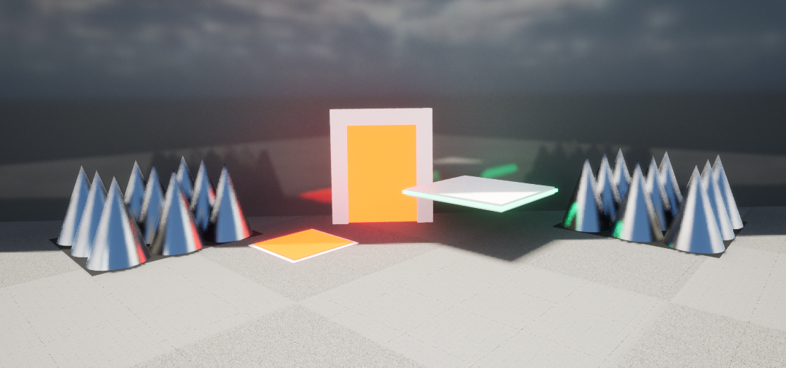
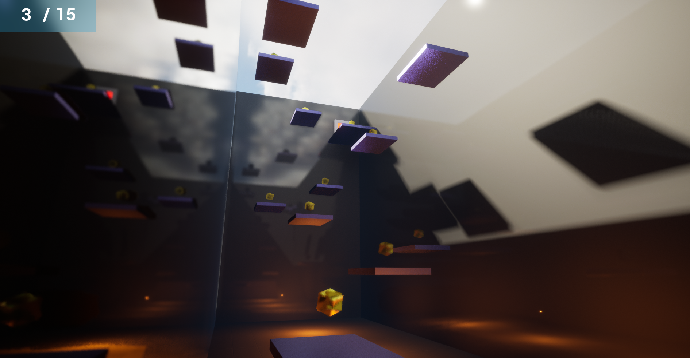
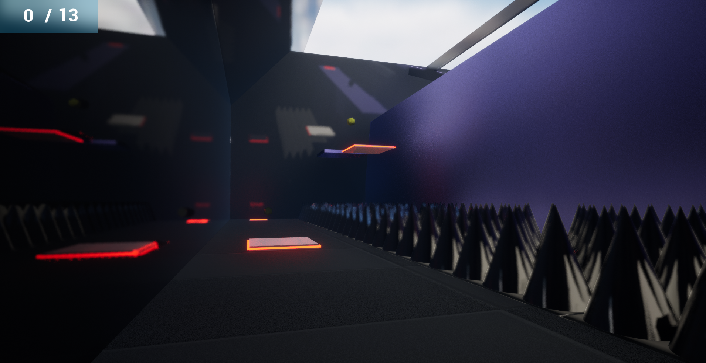
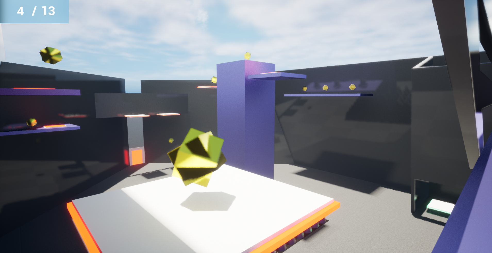

# EEMaze
 
## Unreal Engine 5.0 Blueprint Project
EEMaze is the first person parkour game.
- Player has to collect all gems to enable door and complete level. There are 3 different levels.
- There are moving and stable platforms. Some of them can be triggered with pressure plates.
- Player should be careful about spikes.
  
  
   
